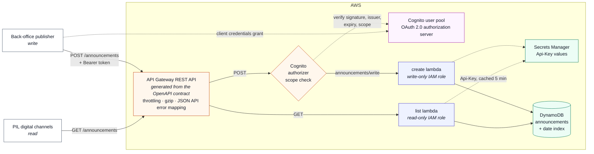
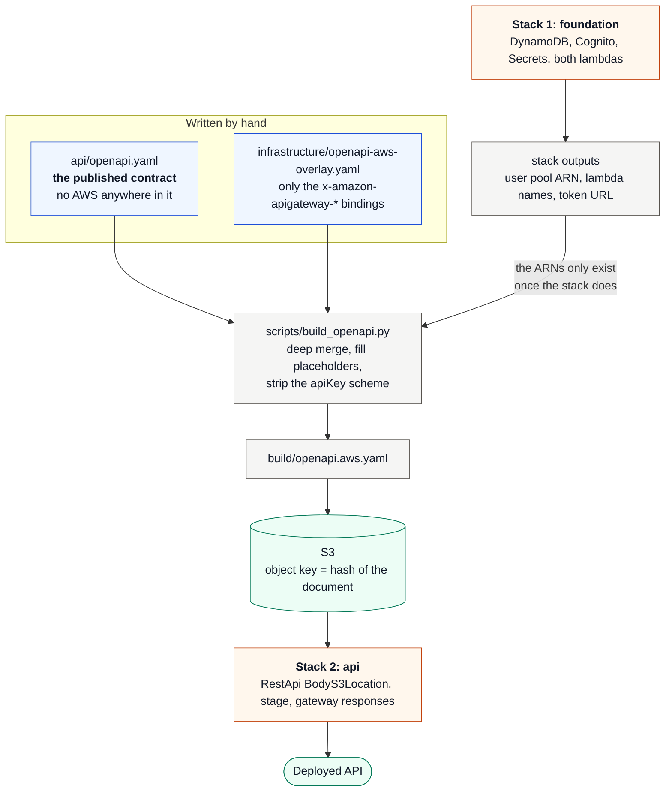

# Announcements microservice

A serverless microservice exposing two JSON REST APIs for storing and
retrieving announcements, built to the PIL RESTful API Guidelines and deployed
entirely from CloudFormation.



Every component above is observed: both lambdas and the stage emit structured
JSON logs, metrics and X-Ray traces, and twelve CloudWatch alarms publish to an
SNS topic. [`docs/architecture.md` §7](docs/architecture.md#7-monitoring-and-alerting)
lists what each alarm catches.

| | |
|---|---|
| **API contract** | [`api/openapi.yaml`](api/openapi.yaml) — OpenAPI 3.0.3, vendor-neutral |
| **Infrastructure** | [`infrastructure/`](infrastructure/) — plain CloudFormation, two stacks |
| **Code** | [`src/announcements/`](src/announcements/) — Python 3.12, no runtime dependencies beyond `boto3` |
| **Tests** | [`tests/`](tests/) — 91 unit/integration tests against `moto`, fully offline |
| **Postman** | [`postman/`](postman/) — 33 requests, ~90 assertions |
| **Design notes** | [`docs/architecture.md`](docs/architecture.md) — the choices and their cost/scale/performance trade-offs |
| **Guideline traceability** | [`docs/api-guidelines-compliance.md`](docs/api-guidelines-compliance.md) — every MUST, and where it is met |

---

## The API in one screen

```http
GET /announcements?limit=20&sort=-announcementDate
Api-Version: 1
Api-Key: <client key>
```
```json
{
  "data": [
    {
      "type": "announcements",
      "id": "9a5f3c1e-6b2d-4f8a-9c0e-1d2b3a4c5d6e",
      "attributes": {
        "title": "Philips opens new Experience Centre in Amsterdam",
        "description": "The new Experience Centre opens its doors on 1 March.",
        "announcementDate": "2026-03-01T09:00:00Z"
      },
      "meta": { "created": "2026-02-04T11:20:31Z", "lastModified": "2026-02-04T11:20:31Z" }
    }
  ],
  "meta": { "count": 42, "pageSize": 1 },
  "links": {
    "self":  "/communications/announcements?limit=1&sort=-announcementDate",
    "first": "/communications/announcements?limit=1&sort=-announcementDate",
    "next":  "/communications/announcements?limit=1&sort=-announcementDate&cursor=djE6eyJr..."
  }
}
```

```http
POST /announcements
Api-Version: 1
Api-Key: <client key>
Authorization: Bearer <access token with scope announcements/write>
Content-Type: application/json
```
```json
{ "data": { "type": "announcements", "attributes": {
    "title": "…", "description": "…", "announcementDate": "2026-03-01T09:00:00Z" } } }
```

Errors are JSON API error documents carrying a code from the guidelines'
standard error list:

```json
{
  "errors": [{
    "id": "c4f1…", "status": "400", "code": "MISSING_PARAMETER",
    "title": "Missing required parameter",
    "detail": "The member title is required.",
    "source": { "pointer": "/data/attributes/title" }
  }],
  "meta": { "requestId": "c4f1…" }
}
```

---

## The contract is the deployment

API Gateway is *defined by* the OpenAPI document: it creates the resources,
methods, models, validators, authorizer and CORS configuration from it. Each
operation is bound to its Lambda by an AWS vendor extension:

```yaml
get:
  x-amazon-apigateway-integration:
    type: aws_proxy          # the whole HTTP request is handed to the function
    httpMethod: POST         # how Lambda is invoked, not the client's method
    uri: arn:aws:apigateway:eu-west-1:lambda:path/.../functions/<fn-arn>/invocations
```

The guidelines also require an API definition to be
implementation-agnostic, and a document full of `arn:aws:...` is not. So the
two concerns live in separate files and are merged at build time:



The deployed API is generated from the published contract, so the two cannot
drift; `make validate` fails the build if an `x-amazon-*` extension ever leaks
into `api/openapi.yaml`.

The build step also strips the `apiKey` security scheme from the copy API
Gateway imports. The scheme is correct in the contract — the guidelines mandate
an `Api-Key` header — but on import API Gateway reads any `apiKey` scheme as a
request for its own usage-plan keys, which are hard-wired to `x-api-key`.
Importing it would reject every conforming request with a 403 before it
reached the handler.

## Why two stacks

| Stack | Owns | Lifecycle |
|---|---|---|
| `announcements-<env>-foundation` | DynamoDB table, Cognito authorization server, `Api-Key` secret, both Lambda functions, SNS alert topic, alarms | Long-lived. Holds state and identity. |
| `announcements-<env>-api` | API Gateway REST API, deployment, stage, gateway responses, API alarms, dashboard | Changes with every contract change. |

They are separate because of a hard ordering constraint, not a preference: the
OpenAPI document that the API stack imports has to name the **Cognito user pool
ARN** and the **Lambda function ARNs**, and a user pool's ARN is only known
after it exists. `scripts/deploy.sh` deploys the foundation, reads its outputs,
builds the document, and then deploys the API stack. The split is also
genuinely useful — the API layer can be torn down and rebuilt without going
anywhere near the data.

---

## Deploying

Prerequisites: an AWS account, the AWS CLI v2 configured, and an S3 bucket in
the target region for CloudFormation artefacts.

```bash
make install                                        # local virtualenv
make test                                           # 91 tests, offline
make validate                                       # contract + template checks
make deploy ARTIFACT_BUCKET=my-cfn-artifacts ENV=dev REGION=eu-west-1
```

`make deploy` prints the invoke URL, the token endpoint and the OAuth client
id. To get everything the Postman environment needs, including the secrets:

```bash
make creds ENV=dev            # or: ./scripts/show_credentials.sh --json
```

Tear it down with `make destroy ENV=dev` (it refuses to touch `prod`).

### Calling it by hand

```bash
BASE=$(aws cloudformation describe-stacks --stack-name announcements-dev-api \
        --query "Stacks[0].Outputs[?OutputKey=='InvokeUrl'].OutputValue" --output text)

curl -s "$BASE/announcements?limit=5" -H 'Api-Version: 1' -H "Api-Key: $API_KEY"
```

```bash
TOKEN=$(curl -s -u "$CLIENT_ID:$CLIENT_SECRET" "$TOKEN_URL" \
          -d grant_type=client_credentials -d scope=announcements/write \
        | python3 -c 'import json,sys; print(json.load(sys.stdin)["access_token"])')

curl -s -X POST "$BASE/announcements" \
  -H 'Api-Version: 1' -H "Api-Key: $API_KEY" -H "Authorization: Bearer $TOKEN" \
  -H 'Content-Type: application/json' \
  -d '{"data":{"type":"announcements","attributes":{
        "title":"Hello","description":"World","announcementDate":"2026-03-01T09:00:00Z"}}}'
```

---

## Testing

```bash
make test                                       # unit + integration, offline (moto)
npx newman run postman/announcements.postman_collection.json \
    -e postman/announcements.postman_environment.json          # against a deployment
```

The Postman collection must be run **in order** — `Setup` fetches an access
token and `Create` seeds the announcements that `List` pages through. Fill the
environment file from `./scripts/show_credentials.sh --json`.

Beyond the per-request assertions, every response is checked against
collection-level invariants: JSON content type, a JSON API document at the
root, `data` and `errors` never coexisting, error codes drawn from the
guidelines' standard list, and no stack traces, ARNs or `boto3` internals
anywhere in a body.

---

## Repository layout

```
api/openapi.yaml                       the published contract (OpenAPI 3.0.3)
infrastructure/
  foundation.yaml                      data, identity, compute, alarms
  api.yaml                             API Gateway, stage, gateway responses, dashboard
  openapi-aws-overlay.yaml             the x-amazon-apigateway-* bindings
src/announcements/
  app/                                 config, errors, http, security, pagination,
                                       validation, repository, middleware, logging
  handlers/                            one module per endpoint
scripts/
  build_openapi.py                     merge contract + overlay
  validate.py                          offline contract and template checks
  deploy.sh / show_credentials.sh / destroy.sh
tests/                                 pytest + moto
postman/                               collection + environment template
docs/
  architecture.md                      component choices, cost, scale, performance
  api-guidelines-compliance.md         traceability against every guideline MUST
```

## Known limitations

* **Publishing the stage needs one CLI call.** `AWS::ApiGateway::Deployment` is
  a point-in-time snapshot; CloudFormation does not create a new one when the
  RestApi body changes, so the stage would keep serving the previous contract.
  `scripts/deploy.sh` issues an explicit `aws apigateway create-deployment`
  after the stack converges. This is a CloudFormation limitation, not something
  the templates can express.
* **One CORS origin.** The preflight is served by a mock integration, which can
  only echo a static origin. A multi-origin allow list needs the preflight
  routed to a Lambda; [`docs/architecture.md`](docs/architecture.md) covers it.
* **No `GET /announcements/{id}`.** The assessment asks for exactly two
  operations, so resource-level `self` links and a `Location` header on 201 are
  deliberately omitted rather than left pointing at an endpoint that does not
  exist.
