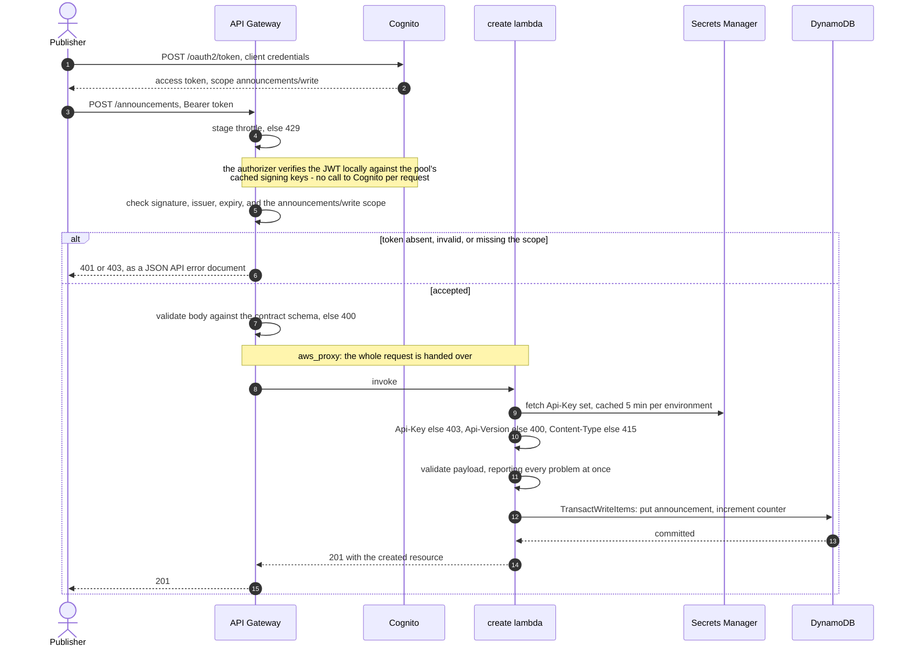
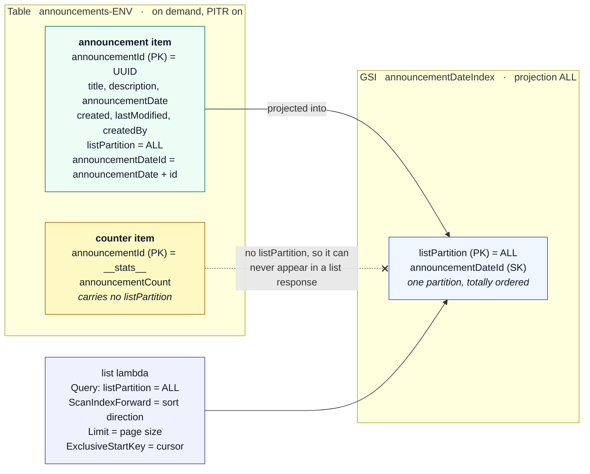
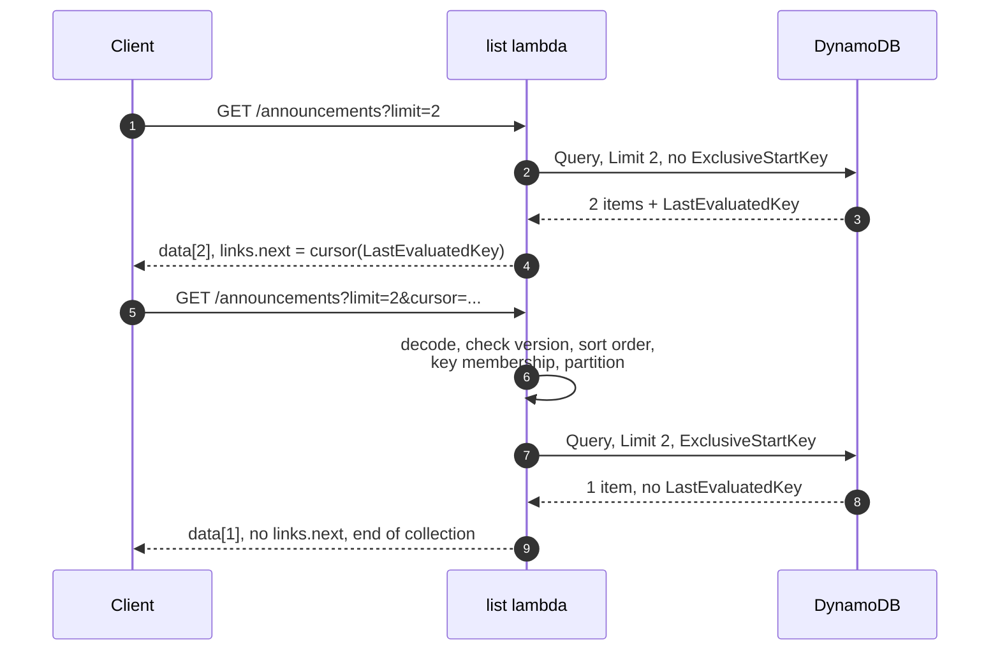

# Design notes

Why each component was chosen, and what it costs in money, scale and latency.
Written against the acceptance criteria in the assessment and the PIL RESTful
API Guidelines.

---

## 1. The shape of the problem

An announcements feed is a **read-heavy, write-rare, small-payload** workload:

* writes arrive from a handful of back-office integrations, a few per day;
* reads come from PIL digital channels and are bursty around a publication;
* the whole collection is measured in megabytes, not gigabytes;
* an announcement is immutable in practice once published.

Almost every decision below follows from that shape. A design tuned for a
high-write, high-cardinality workload would look different, and the places
where that matters are called out.

---

## 2. Component choices

Before the individual choices, here is what they do together. This is the
private path, `POST /announcements`, because it exercises every checkpoint;
the public path is the same minus the authorizer.

Every rejection above, wherever it happens, comes back as the same JSON API
error document. That is what the fourteen gateway responses in
`infrastructure/api.yaml` buy: a client parses one error format, not two.

### API Gateway REST API, not HTTP API

HTTP API (v2) is roughly 70% cheaper per million requests and has lower
latency. It was still not chosen, because three things the guidelines require
are only available on the REST API:

| Needed | REST API | HTTP API |
|---|---|---|
| Customisable gateway responses (JSON API error documents for gateway-level rejections) | yes | no |
| Request validation from the OpenAPI schema | yes | no |
| Full OpenAPI 3 import including models, validators, mock integrations | yes | partial |
| Per-method throttling | yes | per-route, coarser |

Without customisable gateway responses, a client would get
`{"message": "Forbidden"}` from the gateway and a JSON API error document from
the service — two error formats for one API. The guidelines are explicit that
error payloads MUST follow the JSON API error shape, and "except when API
Gateway rejects it first" is not a caveat a client can code against.

The cost difference is immaterial at this volume: at 1 million requests/month
REST API is \$3.50 versus \$1.00 for HTTP API. **\$2.50 a month** to keep one
error format.

### Lambda, not Fargate or App Runner

Traffic is spiky and low-volume with long idle periods, which is exactly the
case where per-request billing wins outright. At 1 million requests/month at
512 MB and ~50 ms, Lambda costs well under \$1; the smallest always-on Fargate
task is ~\$9/month before load balancer costs, and an ALB alone is ~\$16/month.

* **arm64 (Graviton2)** — ~20% cheaper per GB-second, and for pure-Python work
  there is no compatibility cost.
* **512 MB** — CPU is allocated in proportion to memory, so under-provisioning
  memory makes a JSON-and-one-DynamoDB-call handler *slower and no cheaper*.
  512 MB is comfortably past the knee of that curve for this workload.
* **No dependencies beyond the runtime's `boto3`** — no layer to build, nothing
  to keep patched, and cold starts stay short because there is nothing to
  import.
* **Two functions, not one router** — separate IAM roles (the read path
  physically cannot write), separate concurrency and error metrics, separate
  alarms, and a change to one endpoint cannot break the other.

### DynamoDB, not Aurora Serverless or S3

Access patterns are known and fixed: *insert one announcement*, and *page
through all announcements in date order*. That is a key-value workload with one
secondary index, which is DynamoDB's sweet spot. Aurora Serverless v2 has a
minimum ACU floor that bills continuously; DynamoDB on-demand bills per
request and is effectively free at this volume.

**On-demand capacity**, not provisioned: traffic is spiky, the write volume is
tiny, and provisioned capacity would mean paying for idle throughput plus
autoscaling as another thing that can be misconfigured.

### Cognito user pool for OAuth 2.0

The guidelines require authentication through an OAuth 2.0 flow with the
authorization server URL and scopes declared in the API definition. A Cognito
user pool with a resource server gives that with no code: API Gateway's
`COGNITO_USER_POOLS` authorizer validates the JWT signature, issuer, expiry and
**scope** before the request reaches Lambda.

**Client credentials**, because publishing an announcement is a back-office
integration, not something an end user does in a browser. There is no
interactive flow, no refresh token, and nothing to leak from a front end.

The alternative — a Lambda authorizer doing JWT verification by hand — was
rejected: it adds a cryptography dependency, a JWKS cache, and a class of
subtle security bugs, to reimplement something the platform does correctly.

*Cost note:* Cognito bills machine-to-machine token requests per request beyond
the free allowance. With a 60-minute token lifetime and a handful of publishing
clients this is a rounding error, but a client that fetches a fresh token per
request would notice. The token lifetime is set deliberately, not left at the
default.

### Secrets Manager for the `Api-Key` values

API Gateway has a built-in API key mechanism with usage plans, and it would
have been the obvious choice — except that it only reads the **`x-api-key`**
header, and the guidelines mandate **`Api-Key`**. That header name is not
configurable.

So the keys live in a Secrets Manager secret (generated by CloudFormation, so
no key is ever committed) and the handlers compare against it with
`hmac.compare_digest`, caching for five minutes per execution environment. The
hot path is a constant-time string comparison, not a network call.

*Cost:* \$0.40/secret/month. *Trade-off:* per-key usage-plan throttling is
given up; §5 covers what replaces it.

---

## 3. Data model

The sort key is `announcementDate` followed by the announcement id, so two
announcements sharing a timestamp still have a total order.

**Why a constant partition key on the index.** "List every announcement in date
order" is one logical partition by definition. Making it literally one
partition turns the query into a single `Query` — one round trip, results
already sorted, no scatter-gather, no in-memory merge, and a cursor that is
just DynamoDB's own `LastEvaluatedKey`.

**Why the sort key ends in the id.** Two announcements can share a timestamp.
Appending the UUID makes the ordering *total*, which is what lets a cursor
identify exactly one row rather than "somewhere in this second".

**The limit of this design, and the way out.** A single partition caps at
10 GB and 3 000 RCU/s. At ~500 bytes per announcement that is roughly 20
million announcements, and 3 000 RCU/s is far more read traffic than an
announcements feed will see — but it *is* a ceiling. The migration is
well-trodden: replace the constant `"ALL"` with a date bucket
(`listPartition = "2026-03"`), query the buckets newest-first, and stop when
the page is full. It costs a loop in the repository and a cursor that carries
the bucket, and nothing outside `repository.py` and `pagination.py` changes.
Doing it now would be paying complexity up front for a scale this service will
not reach.

**The `__stats__` item.** `meta.count` is a real total, not an estimate:
`create` writes the announcement and increments a counter item in a single
`TransactWriteItems`, so the two cannot diverge. `DescribeTable`'s `ItemCount`
was the alternative and is updated roughly every six hours — useless for a
freshly created announcement. The cost is one extra write unit per create and
one eventually-consistent read per list. The counter item carries no
`listPartition` attribute, so it never appears in the index and can never leak
into a list response.

---

## 4. Pagination

Cursor-based, through the reserved `cursor` and `limit` parameters.

The guidelines allow index-based (`offset`/`limit`) or cursor-based, and point
at the deciding factor: index-based pagination serves duplicates and misses
rows when the collection changes underneath the client. An announcements feed
is append-heavy at the *front* of the default sort order, which is precisely
the case where offsets shift under a paging client.

It is also the only scheme DynamoDB can serve in constant time. There is no
`OFFSET`: skipping 10 000 rows means reading and discarding 10 000 rows, and
paying for them.

A cursor is a base64url-encoded, versioned envelope around DynamoDB's
`LastEvaluatedKey`. It is validated strictly on the way back in — version,
sort direction, exact key membership, value types, and that the partition is
the one this API serves. Every failure is a `400`, never a `500` and never a
read outside the collection.

A page that ends exactly on the collection boundary still carries a `next`
link, because DynamoDB returns a `LastEvaluatedKey` whenever it stopped early —
it cannot distinguish "stopped at the limit" from "stopped at the limit *and*
there is nothing after it". Suppressing that would cost a speculative extra
read on every page to save one cheap request at the end of a walk, so the
contract documents the behaviour instead: page until `next` is absent, and
treat an empty page as the end.

`prev` and `last` links are not offered. Forward-only is what makes cursors
cheap and stable, and the guidelines list those links as optional.

---

## 5. Performance, cost and scale

### Latency

| Contributor | Typical |
|---|---|
| Cold start (Python 3.12, arm64, no dependencies) | ~200–300 ms |
| Warm invocation | ~5–15 ms |
| DynamoDB `Query` on the index | ~5–10 ms |
| Secrets Manager lookup | ~30 ms, **once per 5 minutes per environment** |

Everything expensive is cached across invocations: the boto3 clients, the
DynamoDB connection pool and the API key set are all module-level and survive
warm starts. Connect and read timeouts are set explicitly (1 s / 3 s) with
three standard-mode retries, so a slow dependency fails fast inside the 10 s
function timeout instead of holding the caller.

Conditional GET does the rest. List responses carry a strong `ETag` and
`Cache-Control: public, max-age=60`; a client that sends `If-None-Match` gets a
`304` with no body.

### What this costs at 1 million requests/month

| | |
|---|---|
| API Gateway REST | \$3.50 |
| Lambda (512 MB arm64, ~50 ms) | < \$1 |
| DynamoDB on-demand (1M reads, few writes) | < \$1 |
| Secrets Manager | \$0.40 |
| CloudWatch logs, metrics, alarms, dashboard | ~\$3–5 |
| Cognito M2M tokens | negligible at a 60-minute lifetime |
| **Total** | **under \$12/month** |

Log retention is a parameter (30 days by default) because at scale CloudWatch
Logs is usually the largest line on a serverless bill, not compute.

### Where it scales, and where it does not

Scales without intervention: API Gateway (10 000 rps/account soft limit),
Lambda (1 000 concurrent executions soft limit, both raisable), DynamoDB
on-demand (adapts automatically, and the table is far below any partition
limit).

The two real ceilings are the **single index partition** (§3) and **account
concurrency**. The list function accepts an optional reserved concurrency so a
traffic spike cannot starve every other function in the account — capping the
blast radius of a bad day, and of the bill.

If read volume ever justified it, the next step is a CloudFront distribution or
an API Gateway cache in front of the list endpoint. The `ETag`/`Cache-Control`
headers are already correct for it, so it is a configuration change rather than
a rewrite.

### Rate limiting

Stage-level and per-method throttling (50 rps steady, 100 burst by default),
returning `429` with the standard error document, which satisfies the
guidelines' MUST. The SHOULD — *per API key* — is not met, because usage plans
require the `x-api-key` header (§2). The production answer is AWS WAF with a
rate-based rule keyed on the `Api-Key` header, which also brings IP reputation
and bot control. It was left out here because a WAF web ACL costs ~\$6/month
plus per-rule and per-request charges, which is more than the rest of this
service put together.

---

## 6. Security

* **HTTPS only.** API Gateway does not serve plaintext HTTP, so the
  guidelines' "reject non-HTTPS" requirement is met by construction.
* **Least privilege, per function.** Two IAM roles. The list role has
  `dynamodb:Query` and `GetItem` on the table and its index and nothing else —
  it physically cannot write. The create role has `PutItem` and `UpdateItem`
  and cannot read the collection. Both are scoped to the specific table ARN,
  and the log permissions to the specific log group.
* **Scoped invoke permissions.** Each `AWS::Lambda::Permission` names the exact
  API, method and path, so no other API in the account can invoke the handler.
* **No internal detail in responses.** Every unexpected exception becomes an
  opaque `SERVER_ERROR` carrying only the request id. There is a test that
  fails if a stack trace, an exception type, or a table name reaches a response
  body, and a collection-level Postman assertion that scans every response for
  `Traceback`, `boto3`, `/var/task` and `arn:aws`.
* **Nothing sensitive in logs.** Access logs and application logs record
  method, path, status, latency, request id and OAuth client id — never
  payloads, `Api-Key` values or `Authorization` headers. API Gateway data
  tracing is explicitly disabled.
* **Constant-time key comparison**, because a timing oracle on an API key is
  still a credential leak.
* **Deny-by-default CORS.** One explicitly configured origin. The contract
  forbids `*`, and a Postman assertion fails if it ever appears.
* **Encryption at rest** on DynamoDB with an AWS-owned key, and in Secrets
  Manager. A customer-managed KMS key adds cost without adding a control this
  data needs; if the classification of announcements ever changed, it is a
  one-property change.
* **No secrets in the repository.** The `Api-Key` is generated by
  CloudFormation and the OAuth client secret by Cognito; both are read at
  deploy time by `scripts/show_credentials.sh`.

---

## 7. Monitoring and alerting

Everything routes to one SNS topic, which takes an optional email subscription
and is the integration point for PagerDuty or Opsgenie.

| Alarm | Fires when | Why it matters |
|---|---|---|
| `api-5xx` | any 5XX in 5 minutes | the service is broken |
| `api-4xx-rate` | >25% of requests rejected, 2 periods, with a >20 request floor | a client shipped against the wrong contract, or someone is probing for keys |
| `api-latency` | p99 > 2 s, 2 periods | degradation before it becomes an outage |
| `list-errors` / `create-errors` | any Lambda error | per-endpoint, so the page names the culprit |
| `lambda-throttles` | any throttle | concurrency headroom is gone |
| `list-latency` | p95 > 2 s | drifting towards the 10 s timeout |
| `table-throttles` | any DynamoDB throttle | the partition is hot, or on-demand is still adapting |
| `table-system-errors` | DynamoDB 5xx | dependency failure |
| `application-errors` | an `ERROR` line in either log group | catches anything the Errors metric dilutes |

Every alarm treats missing data as healthy — no traffic is not an incident —
and the 5XX alarms also fire on `OK`, so recovery is visible without opening
the console.

Supporting these: **structured JSON logs** (one object per line, so Logs
Insights queries need no regexes, and so the `{ $.level = "ERROR" }` metric
filter works at all), **JSON access logs** on the stage, **X-Ray active
tracing** on both functions and the stage for end-to-end breakdowns, and a
**CloudWatch dashboard** with traffic, latency, Lambda, DynamoDB and a live
query of recent rejections.

---

## 8. Decisions worth arguing with

Deliberate choices someone might reasonably make differently.

* **No `GET /announcements/{id}`.** The assessment asks for two operations.
  Adding a third would be scope creep — but its absence is why resource-level
  `self` links and a `Location` header on `201` are omitted rather than left
  pointing at an endpoint that does not exist.
* **Global service, no region in the hostname.** Announcements are the same
  worldwide, and the guidelines say region identifiers MUST NOT be used for
  global services. A single-region deployment backs it today; DynamoDB Global
  Tables is the path to multi-region.
* **`announcementDate` is a date-time, not a full date.** The guidelines define
  both. A date-time orders unambiguously, which the pagination sort key needs.
  Sub-second precision is dropped on normalisation — the id suffix in the sort
  key already breaks ties.
* **Validation happens twice.** API Gateway validates the body against the
  contract's JSON Schema, which keeps malformed traffic off the Lambda bill;
  the handler validates again because it is the layer that can produce a JSON
  Pointer to the offending member and report every problem in one response.
* **Errors are reported in batches.** JSON API models `errors` as an array, so
  a client fixing a payload learns everything wrong with it at once.
* **The `Api-Key` check runs before the `Api-Version` check.** Both are
  required; a request missing both has to be answered as one or the other.
  Identifying the caller first is the more conventional order, and it is
  covered by a test so the behaviour is intentional rather than incidental.
